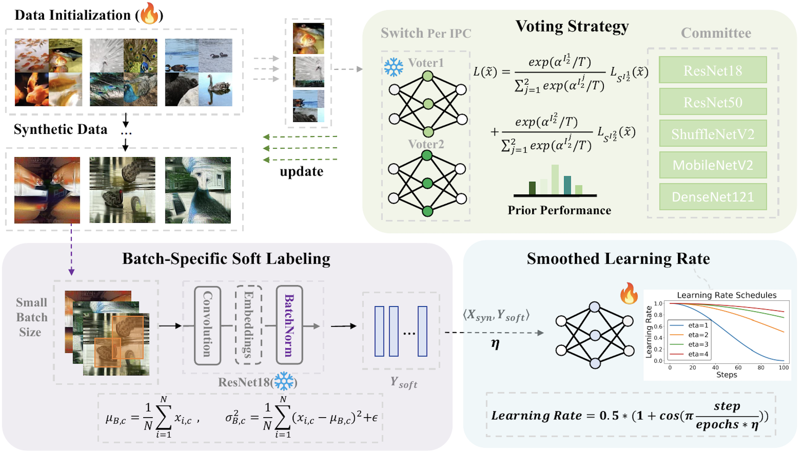
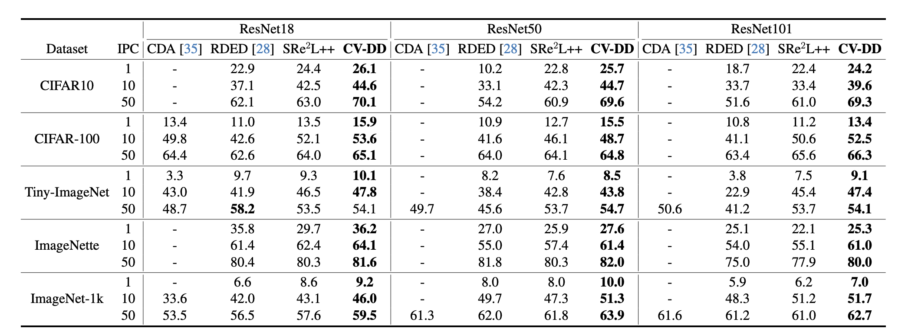

# Dataset Distillation via Committee Voting (CV-DD)

Jiacheng Cui, Zhaoyi Li, Xiaochen Ma, Xinyue Bi, Yaxin Luo, Zhiqiang Shen

[`arXiv`](https://arxiv.org/abs/2501.07575) | [`BibTeX`](#bibliography)

This is an official PyTorch implementation of the paper **Dataset Distillation via Committee Voting**. In this work, we:

- We propose a novel framework, Committee Voting for
Dataset Distillation (CV-DD), which integrates multiple
model perspectives to synthesize a distilled dataset that
encapsulates rich features and produces high-quality soft
labels by batch-specific normalization.

- By integrating recent advancements, refining framework
design and optimization techniques, we establish a strong
baseline within CV-DD framework that already achieves
state-of-the-art performance in dataset distillation.

- Through experiments across multiple datasets, we demonstrate that CV-DD improves generalization, mitigates overfitting, and outperforms prior methods in various datalimited scenarios, highlighting its effectiveness as a scalable and reliable solution for dataset distillation.


## Abstract

<p align="center">

</p>

Dataset distillation aims to synthesize a smaller, representative dataset that preserves the essential properties of the original data, enabling efficient model training with reduced computational resources. Prior work has primarily focused on improving the alignment or matching process between original and synthetic data, or on enhancing the efficiency of distilling large datasets. In this work, we introduce Committee Voting for Dataset Distillation (CV-DD), a novel and orthogonal approach that leverages the collective wisdom of multiple models to create high-quality distilled datasets. We start by showing how to establish a strong baseline that already achieves state-of-the-art accuracy through leveraging recent advancements and thoughtful adjustments in model design and optimization processes. By integrating distributions and predictions from a committee of models, our method captures a broader range of data features, mitigates model-specific biases, and enhances generalization. This voting-based strategy not only promotes diversity and robustness within the distilled dataset but also significantly reduces overfitting, resulting in improved performance on post-eval tasks. Extensive experiments across various datasets and IPCs (images per class) demonstrate that Committee Voting leads to more reliable and adaptable distilled data compared to single/multi-model distillation methods, demonstrating its potential for efficient and accurate dataset distillation.

## Distilled Images
The distilled images for different datasets can be found [here](https://drive.google.com/drive/folders/1DHFe43l-R0GZR9poAP5YjAFzhaBtUw2a?usp=drive_link). We provide IPC values of 1, 10, and 50 for CV-DD, and IPC50 for $\text{SRe}^2\text{L}^{++}$. If you need IPC=1 or 10, you can simply sample them from the IPC50 dataset.

## Overall Configuration
To ensure the functionality of the code, please kindly download some required materials from the [Google Drive Link](https://drive.google.com/drive/folders/1TQ8B2S8CGoMTt175a-wVN-iiLLzD3oz8?usp=drive_link) and store them in a specific folder. The name of this folder is not limited. However, in this folder, we expect several sub-folders:

- `patches/`
- `offline_models/`
- `test_data/`

Please ensure the names match exactly.

We expect the following format for storing the required data:

```plaintext
CV_DD_data/
├── offline_models/
│   ├── cifar10/
│   └── cifar100/
│   └── imagenet-nette/
│   └── tiny_imagenet/
├── patches/
│   ├── cifar10/
│   │   └── medium/
│   └── cifar100/
│   │   └── medium/
│   └── imagenet-nette/
│   │   └── medium/
│   └── tiny_imagenet/
│       └── medium/
└── test_data/
    ├── cifar10/
    └── cifar100/
    └── imagenet-nette/
    └── tiny_imagenet/
```


**Note**: Each folder under `offline_models` must contain **5 pretrained models**, which is ResNet18, ResNet50, DenseNet121, ShuffleNetV2, and MobileNetV2. 

After downloading the required files and organizing them into the desired format, update the `Main_Data_path` in the [config.sh](./config.sh) file to the absolute path of the data directory you created, For example, in the above format, you should enter the absolute path for `CV_DD_data`.


## Squeeze
This process compresses the information of the original training data into various models. We provide scripts for compressing different models on different datasets. More details can be found in [squeeze/README.md](squeeze/README.md).

## Recover
This process generates the distilled data using two Models' distribution and prediction with prior information. We provide scripts for distilling multiple dataset on different IPC settings. More details can be found in [recover/README.md](recover/README.md).

## Relabel
This process generates high quaility soft labels by using **BSSL** technique. We provide scripts for generating soft labels for different dataset. More details can be found in [relabel/README.md](relabel/README.md).

## Validate
This process validates the quality of the distilled data and the soft labels. More details can be found in [validate/README.md](validate/README.md).

## Results
Our Top-1 accuracy (%) under different IPC settings across various datasets, compared with different state-of-the-art (SOTA) methods, is summarized in the table below:


## Bibliography

If you find this repository helpful for your project, please consider citing our work:

```
@misc{cui2025datasetdistillationcommitteevoting,
      title={Dataset Distillation via Committee Voting}, 
      author={Jiacheng Cui and Zhaoyi Li and Xiaochen Ma and Xinyue Bi and Yaxin Luo and Zhiqiang Shen},
      year={2025},
      eprint={2501.07575},
      archivePrefix={arXiv},
      primaryClass={cs.CV},
      url={https://arxiv.org/abs/2501.07575}, 
}
```
